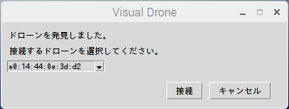

# VisualDrone
This app provide operation for drone with GUI

# DEMO

Visual Droneは、GUIで指定した経路のとおりにドローンが飛行します。


周辺のドローンを探索するボタンをクリックすると、以下のようなサブウィンドウが表示され、ペアリング可能なドローンをプルダウンメニューから選ぶことができます



# Requirement

- python3
- [pyparrot 1.5.3](https://github.com/amymcgovern/pyparrot)
- Parrot MAMBO

# Installation

## pyparrotのインストール

[pyparrot installation](https://pyparrot.readthedocs.io/en/latest/installation.html)から引用

### 依存パッケージのインストール

1. untangleパッケージをインストール:xmlデータを`parrot SDK`用にパースするパッケージ

```bash
pip install untangle
```

2. zeroconfパッケージをインストール:Wifi接続用パッケージ

```bash
pip install zeroconf
```

3. pybluezをインストール:python版BLE接続用パッケージ(Linuxのみ・カメラ接続不可)

```bash
sudo apt-get install bluetooth
sudo apt-get install bluez
sudo apt-get install python-bluez
```

4. bluepyをインストール:もう一つのBLE接続用パッケージ(先述のpybluezと両方必要)

```bash
sudo apt-get install python-pip libglib2.0-dev
sudo pip install bluepy
sudo apt-get update
```

### pyparrotのインストール

1. ソースからインストール

```bash
git clone https://github.com/amymcgovern/pyparrot
cd pyparrot
```

2. pipを使ってインストール

```bash
pip install pyparrot
```

# Usage

```bash
git clone https://github.com/Lium1126/VisualDrone
python3 VisualDrone2.py
```

# Author

* Yoshiya Suzuki
* Hamamatu Technical High School
* 2019 - 2021
